Основы Маппинга
===============

.. note::

    ЛКМ: клик Левой Кнопкой Мыши, ПКМ: Клик Правой Кнопкой Мыши

Следуя данным основам, создаём новый проект в Eureka.

Добавляем комнату
-----------------

Для того, чтобы было удобно рисовать комнаты, жмём :kbd:`f`, чтобы привязать сектора к координатной сетке, и :kbd:`g`, чтобы она появилась. Также жмём клавишу :kbd:`5`для задания размера ячецки сетки в 32 еденицы.

* Жмём :kbd:`tab` и переходим в 2D вид
* Жмём :kbd:`v` и переходим в режим работы с вершинами
* Жмём :kbd:`ПКМ` и начинаем рисовать сектор. Продолжаем добавлять вершины ПКМ, пока не получим нужный результат, и в конце замыкаем сектор.

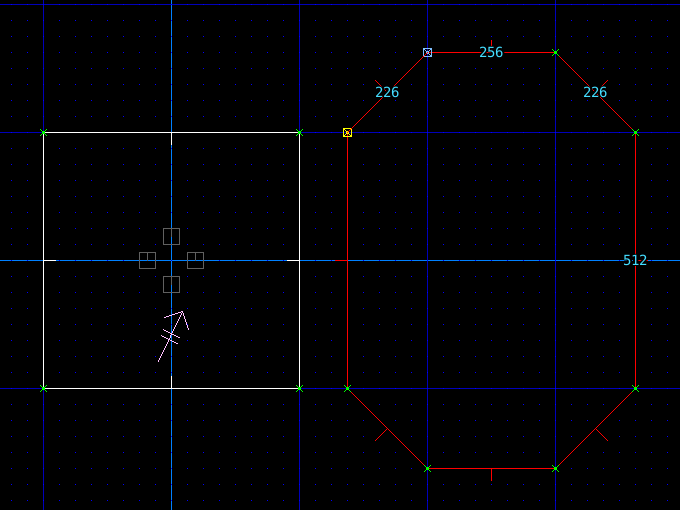

**Добавляем текстуры на стены**

Жмём :kbd:`l` и переходим в режим работы с линиями. Свежесозданные линии будут уже выделены. Если же нет, то кликаем ЛМБ по каждой линии.

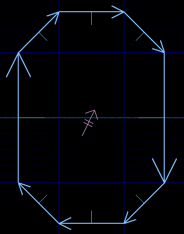

* Наводим курсор мыши на новый сектор и жмём :kbd:`' (апосотф)`, чтобы перенести туда камеру.
* Жмём :kbd:`tab` и переходим в 3D вид
* Кликаем на стену перед нами и выбираем текстуру SLADWALL.

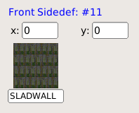
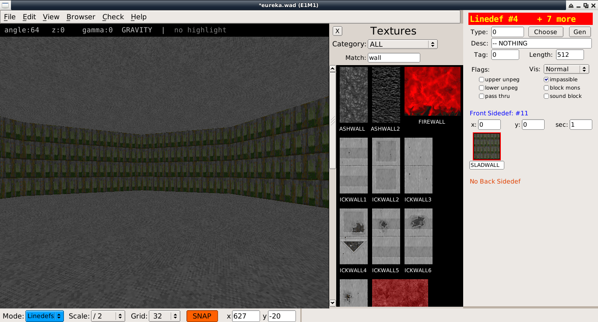

**Добавляем  текстуры на пол и потолок**

* Жмём :kbd:`tab` и возвращаемся в 2D вид
* Жмём :kbd:`s` и переходим в режим работы с секторами. Сектор, по идее, уже будет выделен. Если нет - кликаем по нему ЛКМ.
* Жмём :kbd:`tab` и переходим в 3D вид
* Кликаем по кнопкам текстур **Floor** и **Ceiling** , и выбираем текстуру FLOOR5_1.

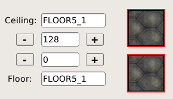
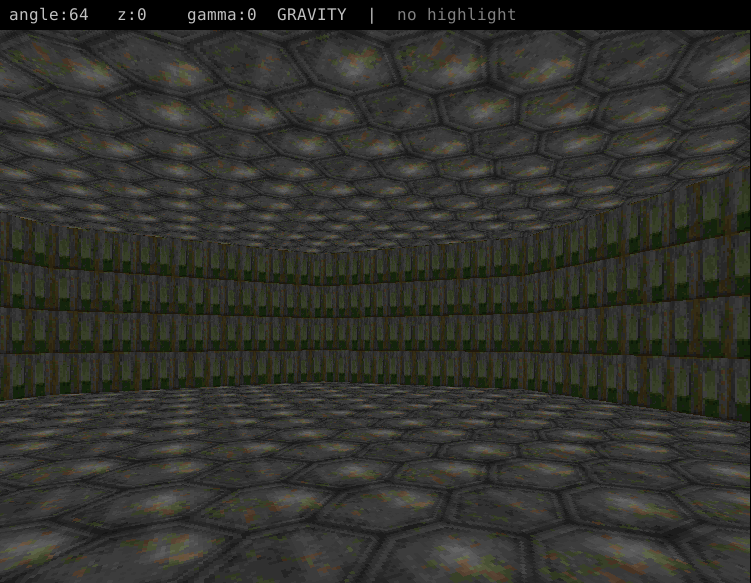

Соединение комнат
-----------------

* Жмём :kbd:`tab` и возвращаемся в 2D вид
* Жмём :kbd:`v` для перехода в режим работы с вершинами
* Кликаем :kbd:`ПКМ` на линии сектора, чтобы поставить там вершину, и тянем линию до соседнего сектора. Повторить 2 раза
* Проверяем расстояние между линиями, оно должно составлять 128 едениц - такова ширина текстуры широкой двери
* По окончании имеем 2 соединенные комнаты.

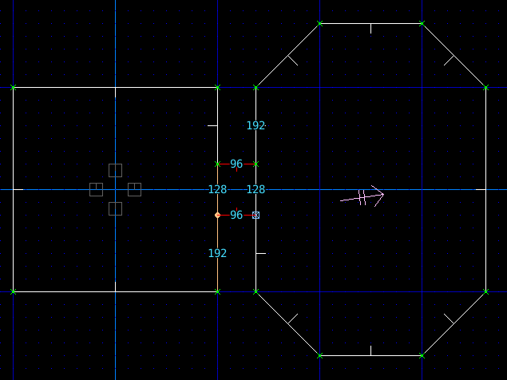
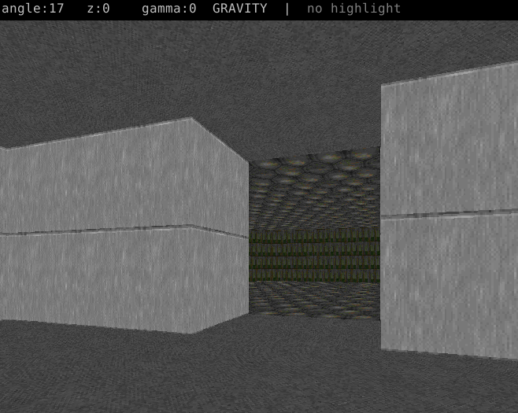

Управляем высотой потолка
-------------------------

* Жмём :kbd:`tab` и возвращаемся в 2D вид
* Жмём :kbd:`s` и возвращаемся в режим работы с секторами
* Выбираем нужный сектор

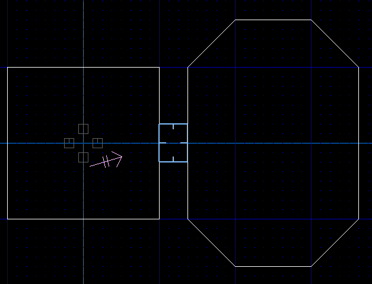

* Жмём :kbd:`tab` и переходим в 3D вид
* Кликаем по кнопкам `+-` вплоть до получения нужного результата

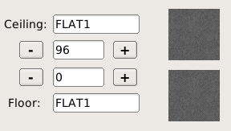

* Как альтернативу, можно использовать клавиши :kbd:`[]`

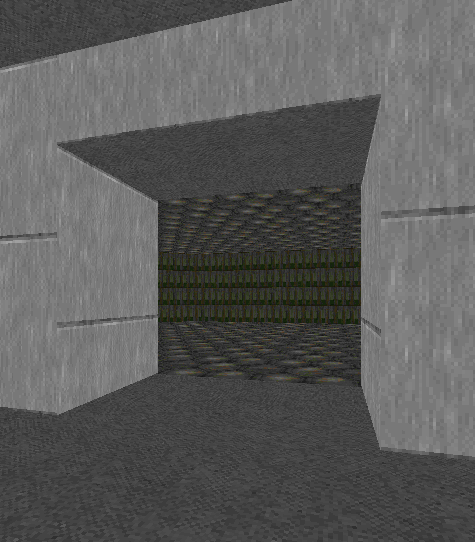

Выравниваем текстуры
--------------------

* Жмём :kbd:`tab` для перехода в 3D режим
* Кликаем :kbd:`ЛКМ` по стенам с кривыми текстурами

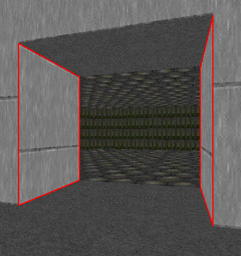

* Для выравнивания текстур жмём следующие сочетания клавиш:
    * :kbd:`x`: выравнивание по оси X влево
    * :kbd:`y`: выравнивание по оси Y влево
    * :kbd:`z`: выравнивание по осям X и Y влево
    * :kbd:`shift-x`: выравнивание по оси X вправо
    * :kbd:`shift-y`: выравнивание по оси Y вправо
    * :kbd:`shift-z`: выравнивание по осям X и Y влево

* Как альтернативу можно воспользоваться меню по клавише :kbd:`F1`.

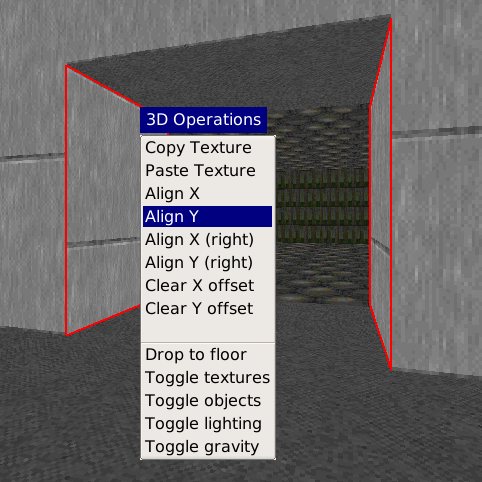

Автоматическое выравнивание
---------------------------

Если же нужно выровнить несколько стен, можно воспользоваться автовыравниванием:

* В 2D виде жмём :kbd:`l` и переходим в режим работы с линиями
* Выделяем нужние линии
* Жмём :kbd:`shift-A` и выравниваем все выделенные линии
* Приём работает и 2D, и в 3D режиме
