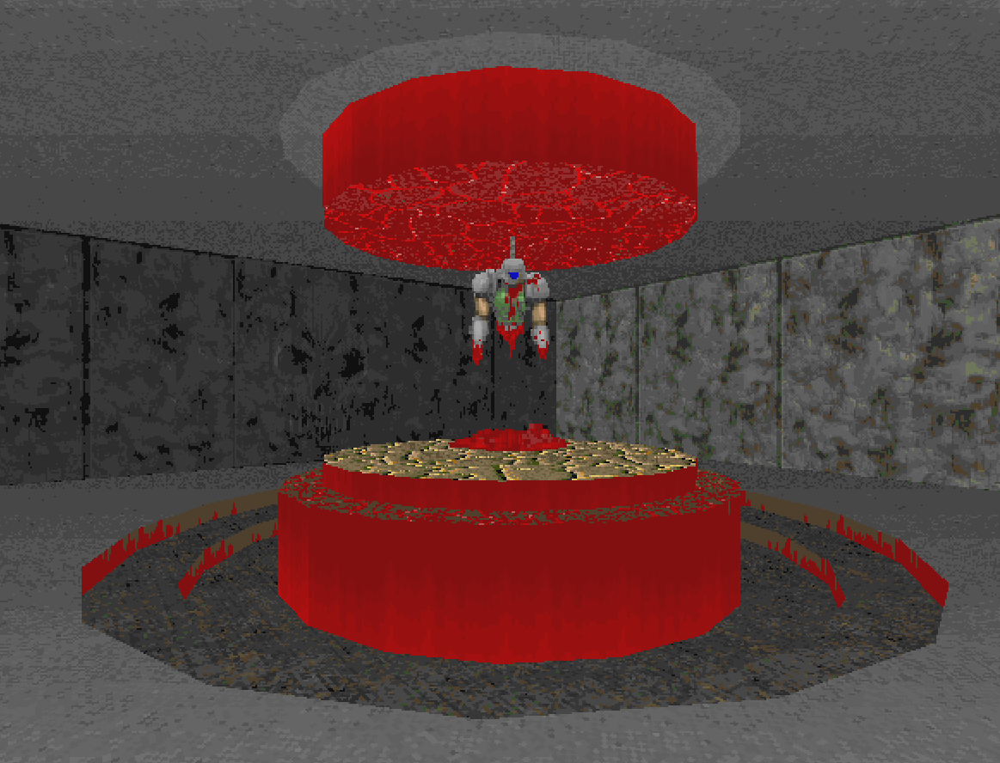
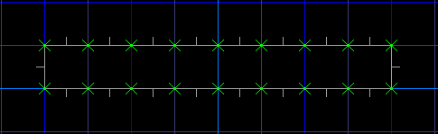
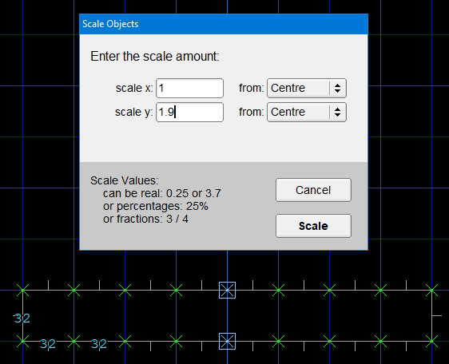
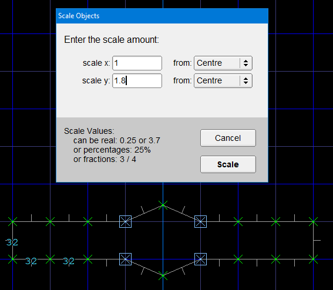
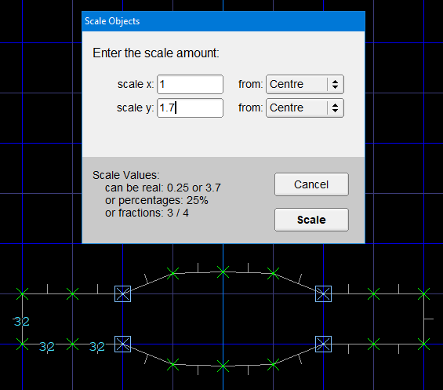
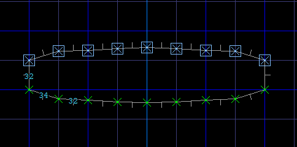
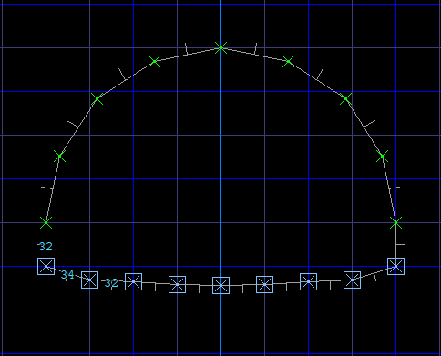
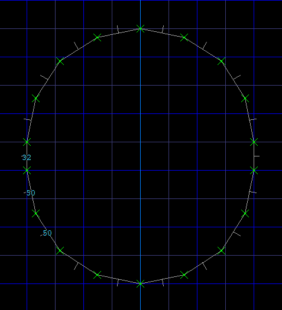
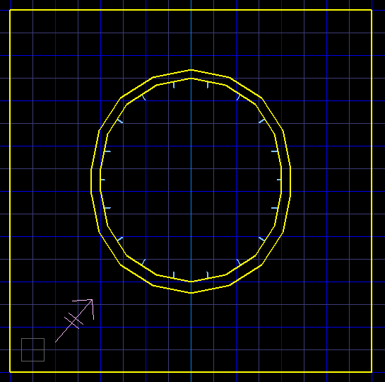
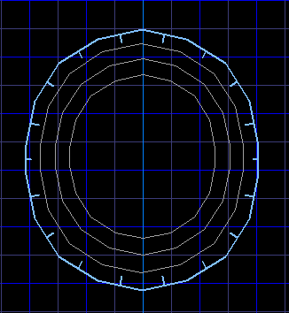

Жертвенный алтарь
=================

Используя концентрические круги мы построим жертвенный алтарь.

Method
------

В режиме вершин рисуем нарезанный на равные отрезки прямоугольник:

Этот прямоугольник мы превратим в круг, используя инструменты формирования арки.

Выдели центральную пару точек и подвинь их на `1.9` по оси `y`:

Снимаем выделение и выбираем пары точек с обеих сторон и двигаем их на `1.8` по оси `y`:

Следующие пары точек двигаем на `1.7`.

И так до тех пор, пока не дойдём до края.

Каждую пару вершин мы двигали на одну десятую меньше предыдущей, это даёт нам общий контур и задаёт направление вершин. Если мы будем формировать арку "от потолка", редактор нам выдаст сообщение "strange shape".

Выделяем врешины из верхнего ряда и формируем арку с углом 180 градусов комбинацией клавиш :kbd:`shift-d`:

Выделяем нижний ряд вершин и снова жмём :kbd:`shift-d`:

Теперь у нас есть основа будущего алтаря:

Переходим в режим секторов и выделяем наш круг. Сочетаниями :kbd:`control-c` и :kbd:`control-v` делаем копию. Уменьшаем копию на `1.2` по осям `x` и `y` planes.

Переходим в 3D вид и видим, что вставленный сектор рисуется с артефактами, это потому что скопированный сектор нужно соединить с комнатой. Наводим курсор на наш сектор (его контур подсветится), и жмём :kbd:`пробел`:

Повторяем процедуру со вставкой кругов, уменьшая их на `1.4` и `1.6` по осям `xy` соответсвенно. Четырёх кругов, по идее, может быть достаточно:

Высоту каждого этапа, текстуры пола, потолка и стен алтаря выбираем по вкусу.

Загрузки
--------

:download:`altar.wad`
