Изогнутая лестница
==================

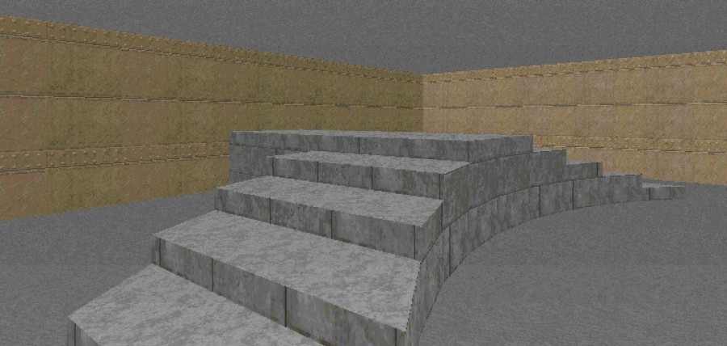

Схема
-----

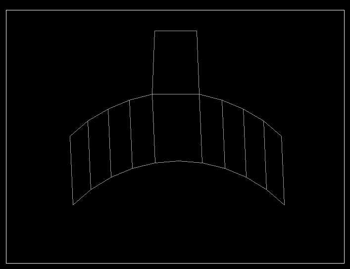

Метод
-----

Рисуем контур будущей лестницы в режиме вершин:

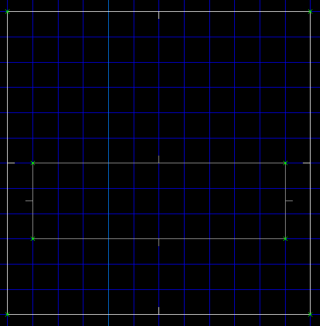

:kbd:`ЛКМ` делим вершинами длинные стороны на отрезки, чтобы определить, где будут ступени:

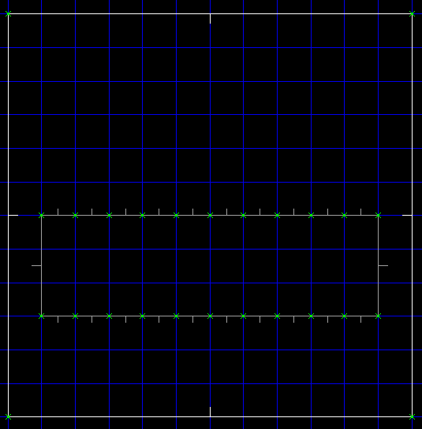

Жмём :kbd:`f` для отвязки вершин от сетки координат, и начинаем двигать вершины так, чтобы получилось что-то наподобие арки.

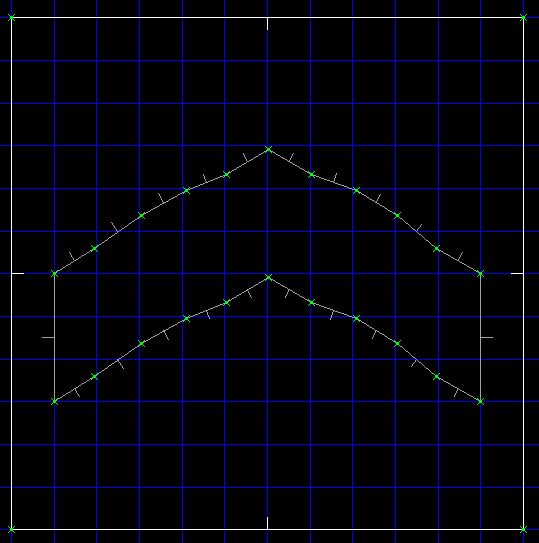

Снимаем выделение со всех вершин (:kbd:`\``) и выделяем только верхний ряд:

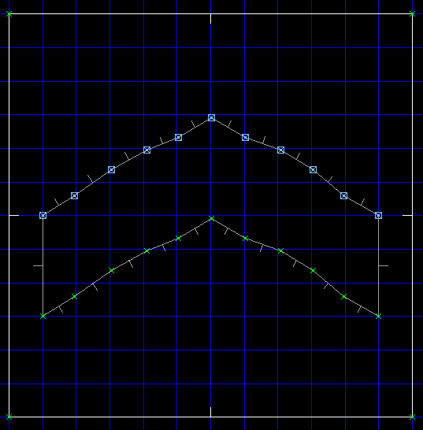

Жмём :kbd:`shift-c` (сформировать арку в 120 градусов):

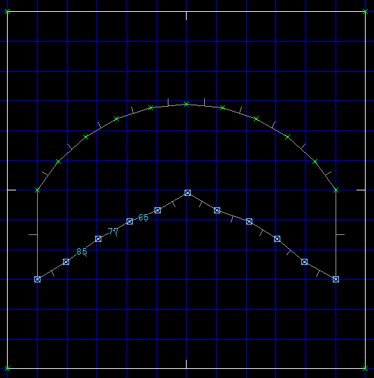

Повторяем предыдущий шаг с нижним рядом вершин и соединяем :kbd:`ПКМ` оба ряда линиями:

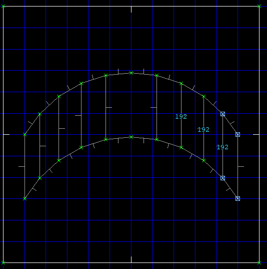

Переходим в режим секторов и, удерживая :kbd:`shift`, выделяем :kbd:`ЛКМ` сектора ступеней:

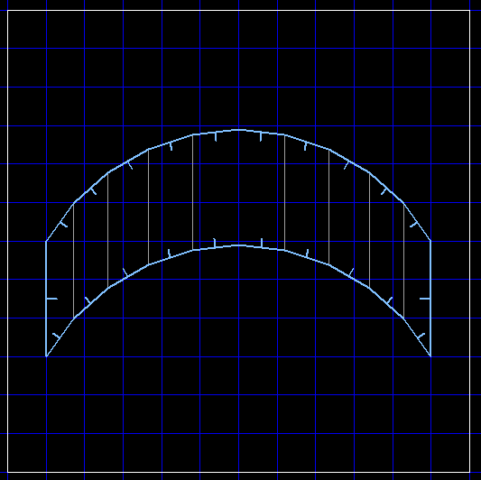

Поднимаем ступени клавишей :kbd:`. (точка)`. :kbd:`ЛКМ` снимаем выделение с крайних секторов:

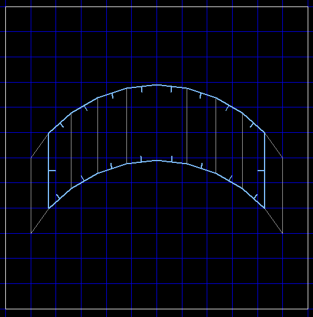

* Повторяем предыдущий пункт до тех пор, пока не дойдём до центра лестницы:

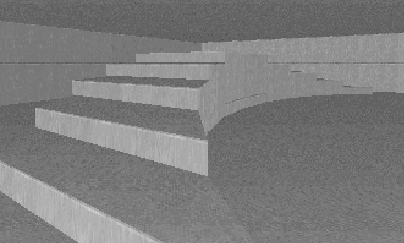

На заметку
----------

Операции по формированию арки есть и в меню на клавише :kbd:`f1`. Тем не менее, в нём нет пункта для арки в 120 градусов, так что придётся использовать сочетание клавиш :kbd:`shift-c`.

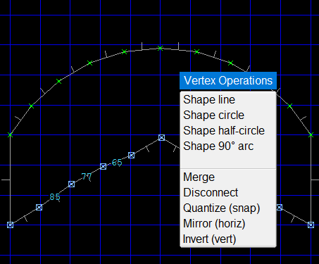

Загрузки
--------

:download:`curved-stairs.wad`
