Двери
=====

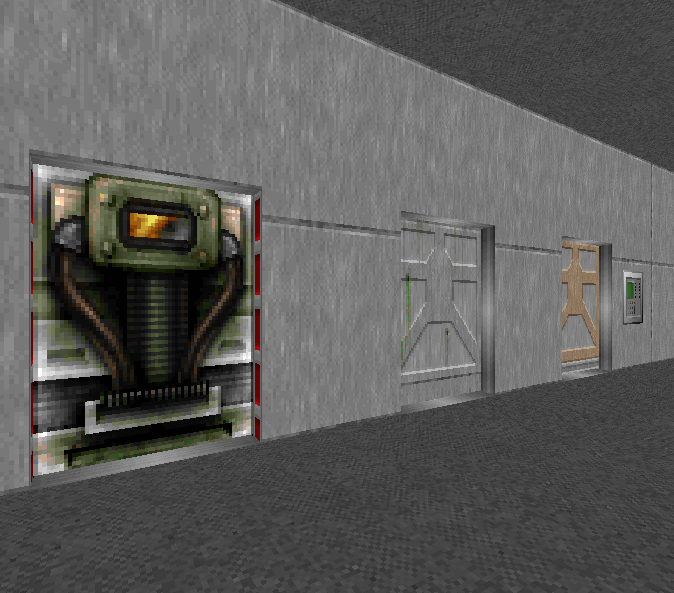

Двери, открываемые вручную, удалённо и кнопкой.

.. На заметку::

    Текстуры дверей встречаются в 2-х размерах: 64 и 128 едениц. Делая дверной проём, постарайтесь это учитывать.

Строим дверь
------------

Данный метод применим для создания основы дверей. На её основе можно создать дверь с кнопкой и др. двери.

* Переходим в режим вершин (:kbd:`v`)
* Соединяем два сектора проёмом

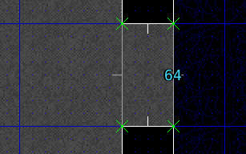

* Меняем размер ячеек сетки координат клавишами :kbd:`3-5`
* Рисуем :kbd:`ПКМ` 2 линии, параллельные проёму

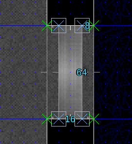

* Переходим в режим линий (:kbd:`l`) и выделяем переднюю и заднюю стороны двери

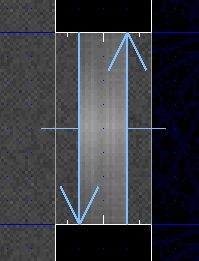

* Т.к. двери выходят из потолка, выбираем передней верхней стороне текстуру `ICKDOOR1`.

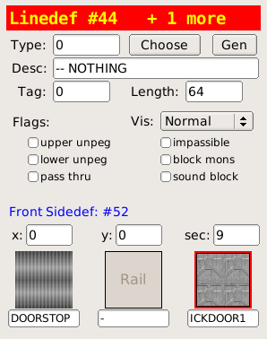

* Переходим в режим секторов(:kbd:`s`) и выделяем сектор нашей двери

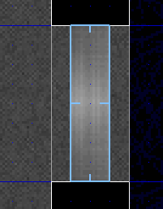

* И опускаем потолок сектора до пола, используя кнопки `+-` возле иконки  **Ceiling** или клавиши :kbd:`[]`.

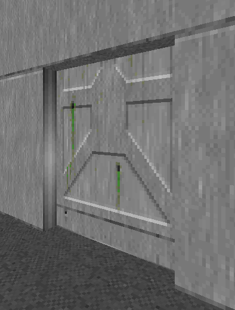

На заметку
----------

В случае, если одна из сторон двери оказалась лицевой стороной вовнутрь двери, в режиме линий жмём :kbd:`F1` и выбираем в меню пункт 'Flip'

Обычные двери
-------------

Обычные двери - двери, которые открываются тогда, когда с ней  напрямую взаимодействует игрок.

* Переходим в режим линий (:kbd:`l`)
* Выделяем обе стороны линий

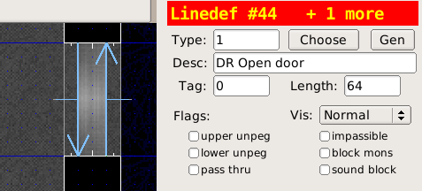

* В графе **Type** выбираем тип линии `1 DR Open Door`

Чтобы дверные треки (часть дверной коробки, по которой движется дверь) не двигались вслед за дверью, нужно:

* Выделить линии треков
* Поставить галочки в окошки **upper unpeg** и **lower unpeg**

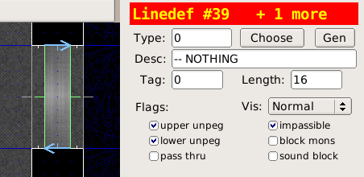

.. На заметку::

    Спэшлы обычных дверей привязываются к сектору автоматически, так что тэги ставить не обязательно.

    Спэшлы с индексом DR можно открывать много раз, тогда как D1-двери можно открыть только один раз.

Запертые двери
--------------

Дверь данного типа открывается ключом соответствующего цвета - Синим, Жёлтым или Красным, и создаётся также, как и обычная. При выборе типа линии обращаем внимание на цвет:

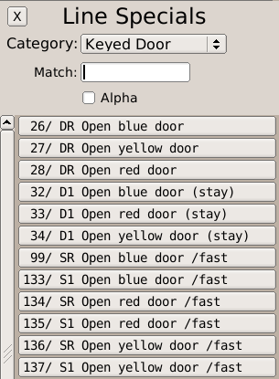

Двери с кнопкой
---------------

Такие двери открывается при помощи кнопок, переключателей и пр.

* Переходим в режим вершин (:kbd:`v`)
* :kbd:`ЛКМ` ставим пару вершин рядом с дверью вдоль стены, должна получиться линия длиной в 64 еденицы

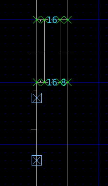

* Переходим в режим линий (:kbd:`l`) и выделяем получившуюся линию
* Выбираем для неё текстуру `SW1GRAY`

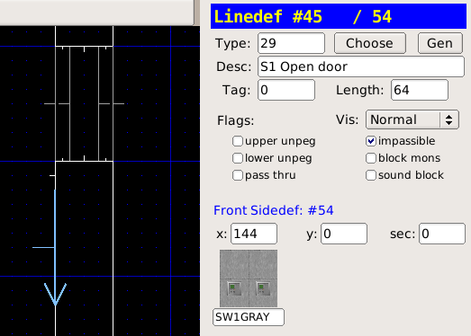

* Задаём тип линии **63 SR Door Open**
* Переводим курсор мыши на сетку, чтобы перенести фокус с панели настроек линий
* Жмём сначала :kbd:`;`, а затем :kbd:`f` чтобы задать линии новый тэг

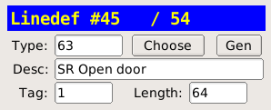

* Переходим в режим секторов (:kbd:`s`) и выделяем сектор двери

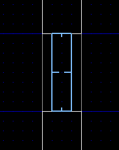

* Жмём сначала :kbd:`;`, а затем :kbd:`l`, чтобы присвоить сектору двери последний использованный тэг

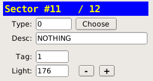

* Eureka подсветит линию и сектор, связанные одним тэгом:

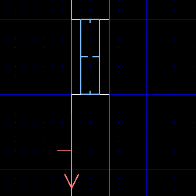

.. На заметку::

    Спэшлы линий SR создают кнопку, которая сработает несколько раз, а S1 срабатывает только 1 раз.

Загрузки
---------

:download:`doors.wad`
