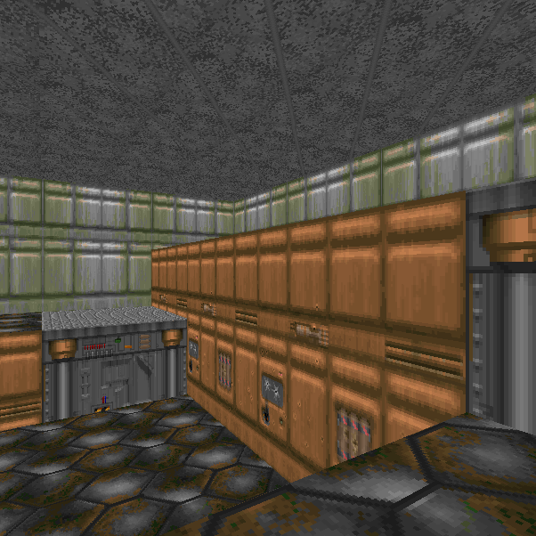
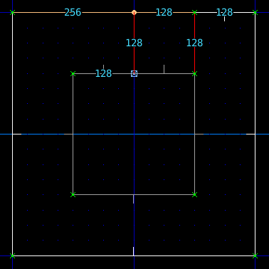
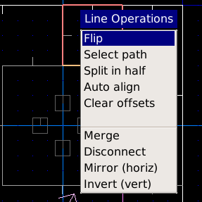
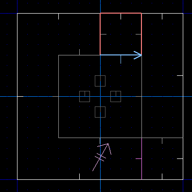
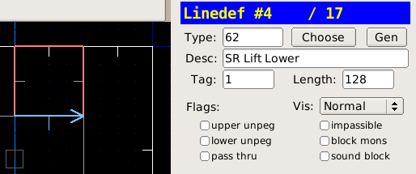
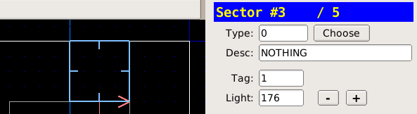

Лифты
=====

Метод
------

* Переходим в режим вершин и рисуем платформу лифта. Она должна быть вровень с поднятым сектором:

* Убеждаемся, что линии платформы повёрнуты лицевыми сторонами наружу, иначе лифт работать не будет.
* Если линии стоят не так, как надо, переходим в режим линий, жмём :kbd:`F1` и выбираем в меню пункт `Flip`:

* Выделяем линию лифта, с которй будет взаимодействовать игрок:

* Назначаем тип линии `62 SR Lower Lift`
* Жмём сначала :kbd:`;` а затем :kbd:`f` и назначаем линии новый тэг

* Переходим в режим секторов (:kbd:`s`) и выделяем сектор лифта
* Жмём сначала :kbd:`;` а затем :kbd:`l` и назначаем сектору последний использованный тэг

.. На заметку::

    Лифты со спэшлами типа SR можно использовать много раз, а с S1 - только 1 раз.

Загрузки
--------

:download:`lifts.wad`
