Заготовки
=========

Заготовки позволяют сэкономить время при создании карты благодаря простому копированию уже готовых конструкций (дверей и пр).

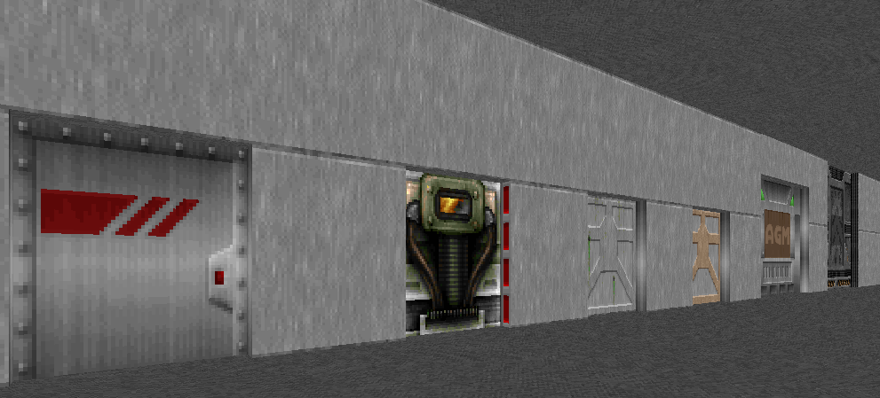

При использовании заготовок нужно помнить о 2 вещах:

1. Копирование работает только в пределах одного WAD файла.
2. После вставки заготовки нужно объединить общие вершины.

Карту с заготовками можно расположить в неиспользуемом слоте.

Загрузки
--------

Как основу для своего набора заготовок будем использовать файл :download:`prefabs.wad`.

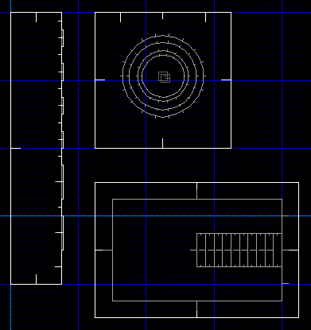

Объединение вершин
------------------

Копируя заготовку в свободное пространство, к примеру дверь, необходимо объеденить её вершины с основным сектором.

Выбрав заготовку двери в режиме секторов, жмём :kbd:`control-c`:

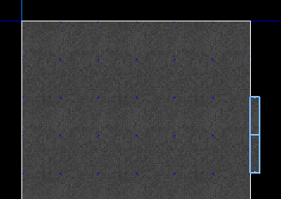

Открыв нужную нам карту, располагаем курсор мыши в нужном месте и вставляем заготовку :kbd:`control-v`:

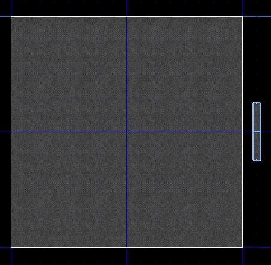

Перейдя в режим вершин, жмём :kbd:`ПКМ`, чтобы соеденить вершины двери с комнатой:

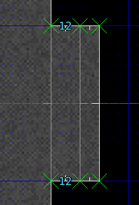

Если между дверью и комнатой дополнительный сектор не нужен, выделяем одну из вершин двери, затем одну из вершин комнаты (порядок имеет значение) и объединяем:

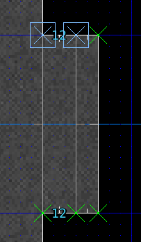

То же самое делаем и с другими вершинамя (выделяя сначала вершину двери):

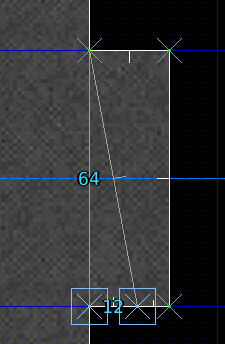

Всё, эта сторона двери готова:

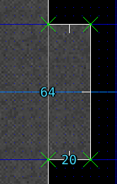

Объединение секторов
--------------------

Процесс вставки одного сектора в другой требует иного способа объединения. Лестница - лишь один из примеров.

Выбираем сектора заготовки. Используем комбинацию :kbd:`shift LMB`, чтобы рамкой выделить все нужные сектора:

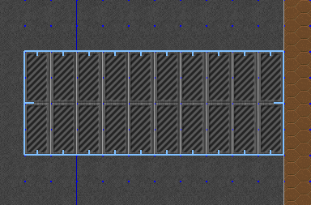

Копируем, открываем нашу карту, и вставляем. Убеждаемся в том, что курсор мыши находится в нужном месте:

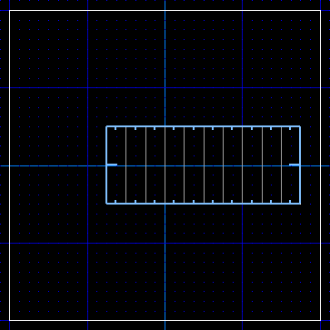

Переходим в 3D вид, видим наши артефакты, говорящие о необходимости объединения:

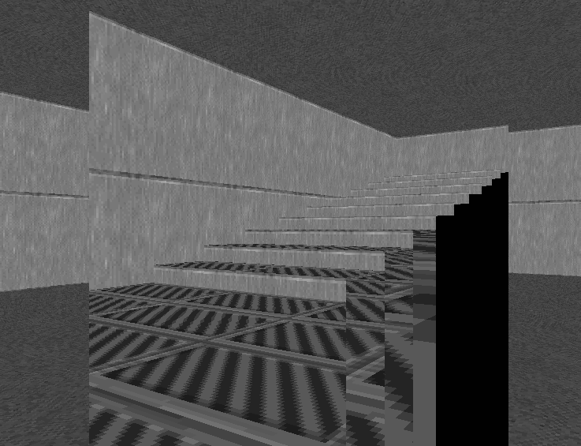

Чтобы объединить сектора, снимаем выделение (:kbd:`\``), наводим курсор на сектор комнаты и жмём :kbd:`space`:

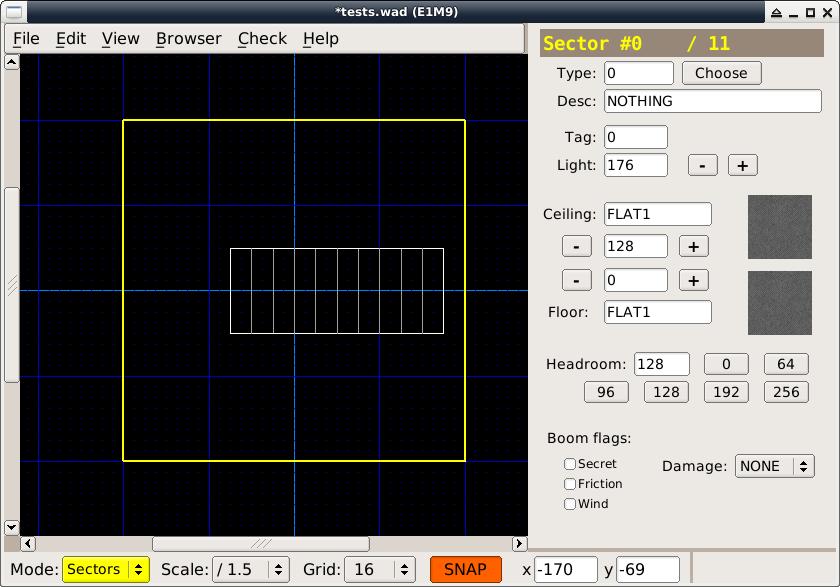

Всё, теперь сектора лестницы объединены с сектором комнаты:

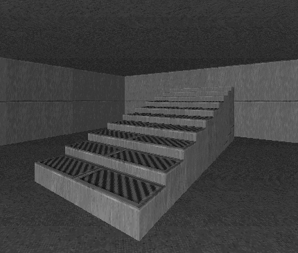
