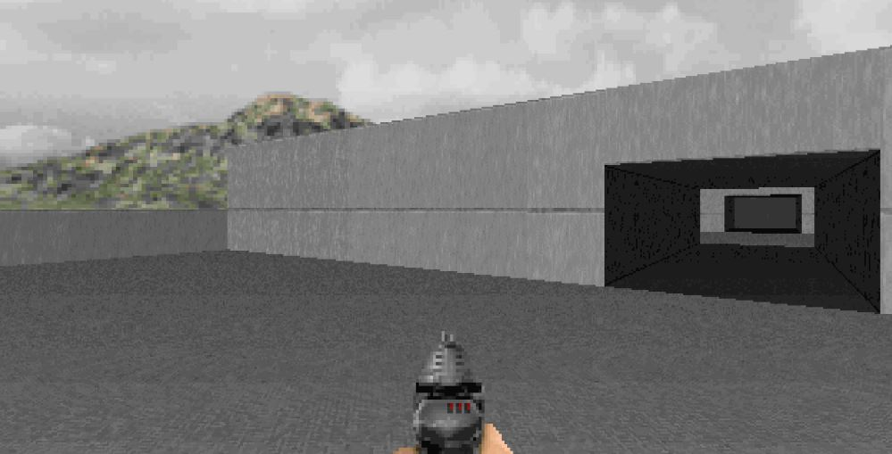
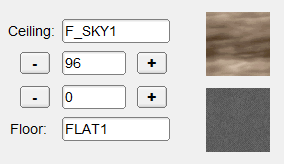
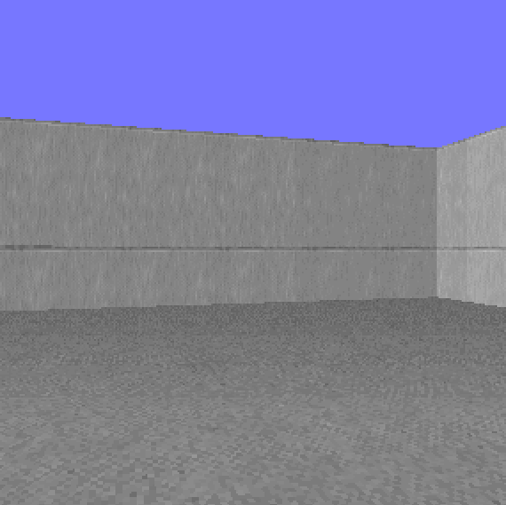
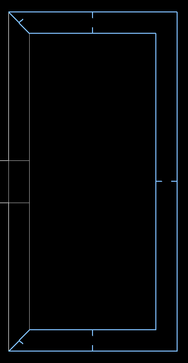

Небо
====

Метод
-----

Создать небо просто - нужно наложить на потолок текстуру `F_SKY1`.

Да и стены могут помочь создать неплохой вид:

Для стен пониже, добавляем приграничный сектор с нужной высотой (на карте он подсвечен):

Опускаем потолок приграничного сектора (:kbd:`[`) и наслаждаемся видом широкого неба.

Загрузки
--------

:download:`sky.wad`

