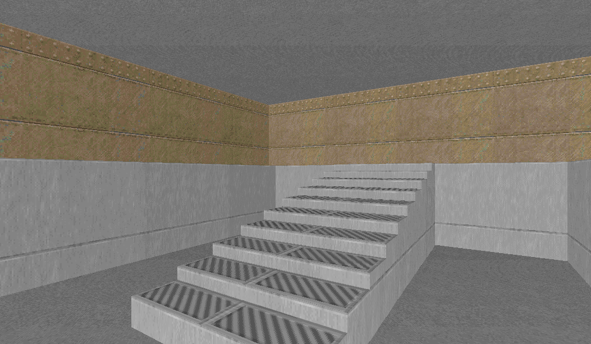
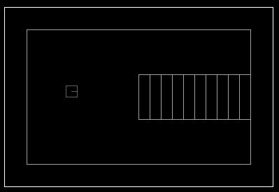
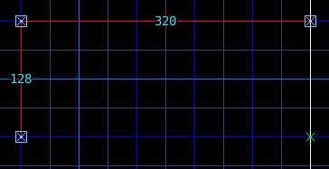
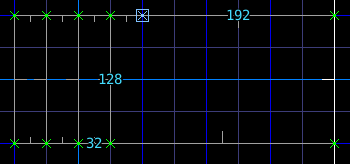
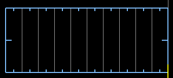
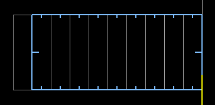
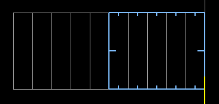

Лестница
========

Схема
-----

Метод
-----

* В режиме вершин :kbd:`ПКМ` рисуем контур будущей лестницы:

* Режем прямоугольник на ступеньки:

* В режиме секторов выбираем все ступеньки:

* Жмём пару раз клавишу поднятия пола :kbd:`. (точка)`
* :kbd:`ЛКМ` снимаем выделение с первой ступени:

* Повторяем предыдущие 2 шага, пока ступеи не закончатся:

Загрузки
---------

:download:`stairs.wad`

