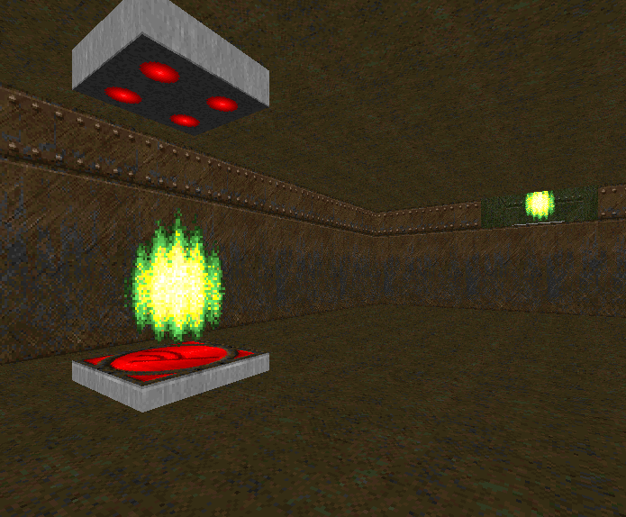
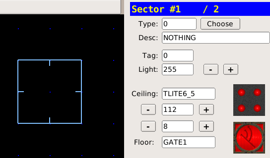
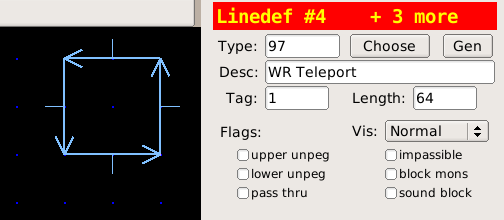
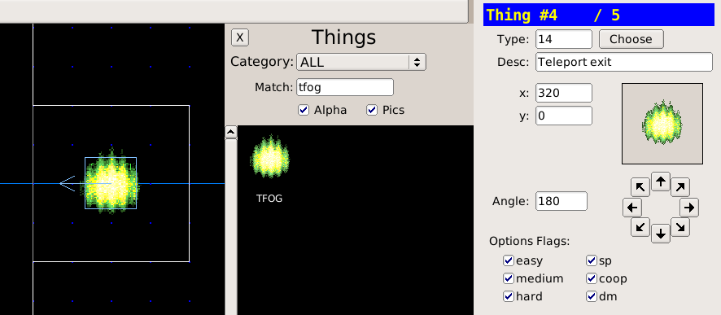

Телепорты
=========

Телепорт срабатывает при пересечении игроком линии с соответсвующим спэшлом. Тэг линии привязывается к тому сектору, на который телепортируется игрок.

Платформа телепорта
-------------------

* Рисуем сектор со стороной 64х64 еденицы
* Текстурой пола указываем `GATE1`, текстурой потолка - `TLITE6_5`

* Переходим в режим линий (:kbd:`l`)
* ЖМём сначала :kbd:`;`, а затем :kbd:`f`, чтобы присвоить новый тэг всем четырём линиям. Отсюда игрок будет телепортироваться.

* Задаём в поле **Type** тип линии `97 WR Teleport`

.. note::

    Телепорт срабатывает только тогда, когда линия направлена **Лицевой** стороной к игроку, а **Задней** - внутрь сектора. Это было сделано специально, чтобы игрок, переходя линию, не активировал ненароком другой телепорт.

Место прибытия
--------------

* Назначаем тэг линий телепорта тому сектору, в который будем телепортироваться, нажимая сначала клавишу :kbd:`;`, а затем :kbd:`l`.
* Переходим в режим предметов (:kbd:`t`), располагаем курсор мыши на секторе и жмём :kbd:`ins` или :kbd:`пробел`. Указываем тип предмета **Type** `14 Teleport Exit` (в браузере предметов отмечен как TFOG)

* Указываем стрелками угол предмета `TFOG`. Углом мы указываем, в какую сторону будет смотреть игрок после телепортации.

Загрузки
--------

:download:`teleporters.wad`
