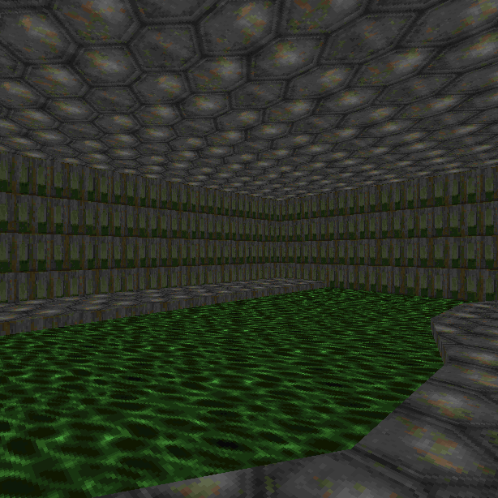
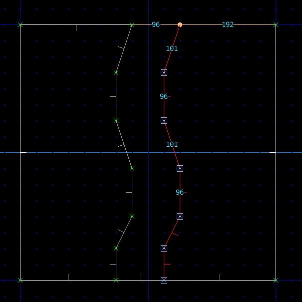
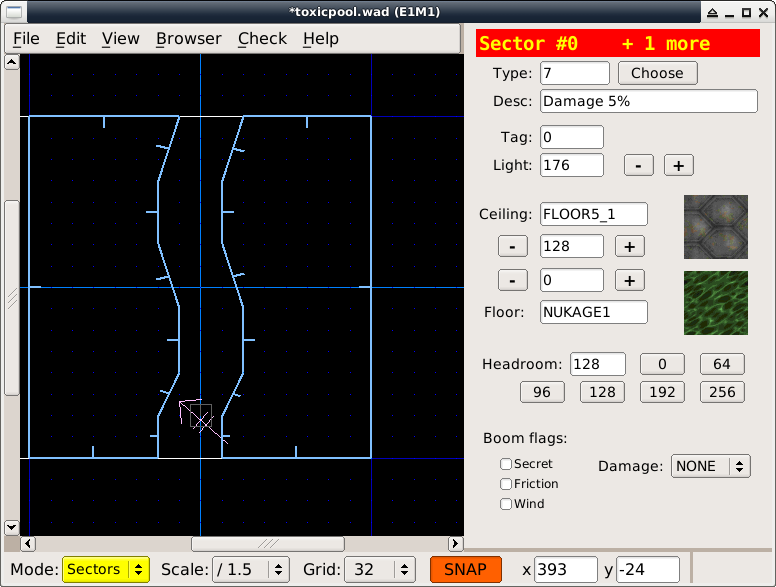
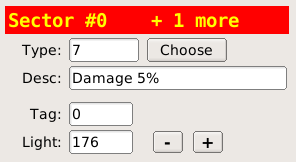
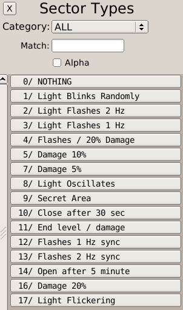
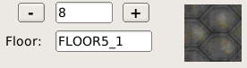

Бассейн с отходами
==================

Токсичные отходы наносят урон игроку.

Метод
-----

* Жмём :kbd:`v` и переходим в режим вершин
* ПКМ :kbd:`RMB` рисуем русло

* Жмём :kbd:`s` и переходим в режим секторов
* Жмём :kbd:`\`` и снимаем выделение
* Выделяем сектор нашей лужи с кислотой
* Кликаем по кнопке тексуры пола и задаём текстуру `NUKAGE1`

* Указываем тип сектора, кликнув по кнопке **Choose**

* Выбираем из списка тип **Damage 5%**

* Жмём :kbd:`\``  и снимаем выделение
* Выделяем сектора, которые будут берегами
* ПОоднимаем пол берегов, кликая по кнопке `+`
* Как вариант, можно поднять пол, нажимая клавишу :kbd:`.`

На заметку
----------

Как вариант, можно просто опустить русло клавишей :kbd:`,`

Загрузки
--------

:download:`toxicpool.wad`
