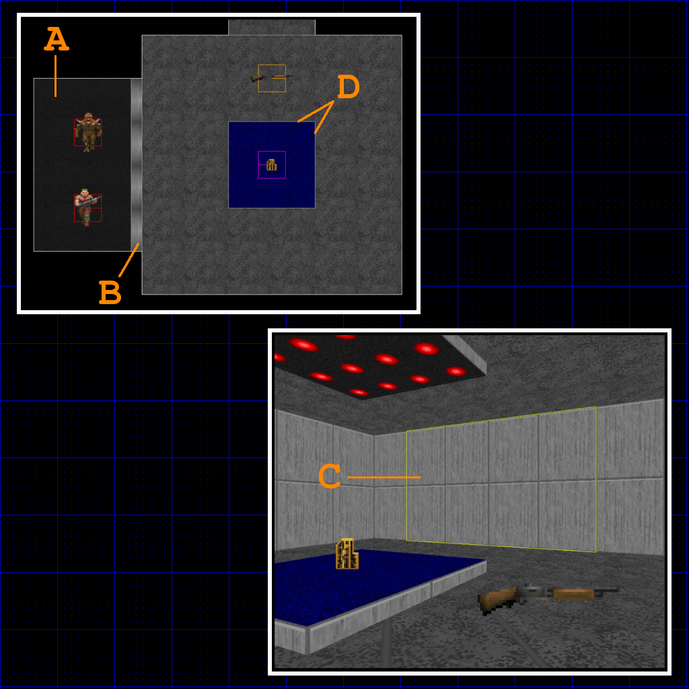
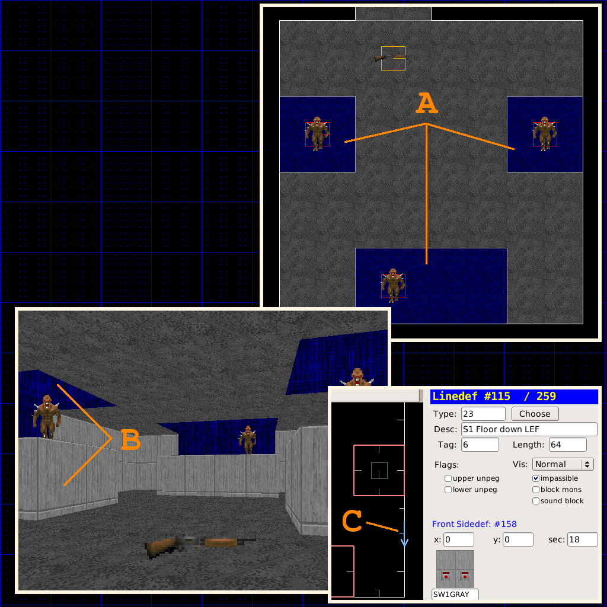
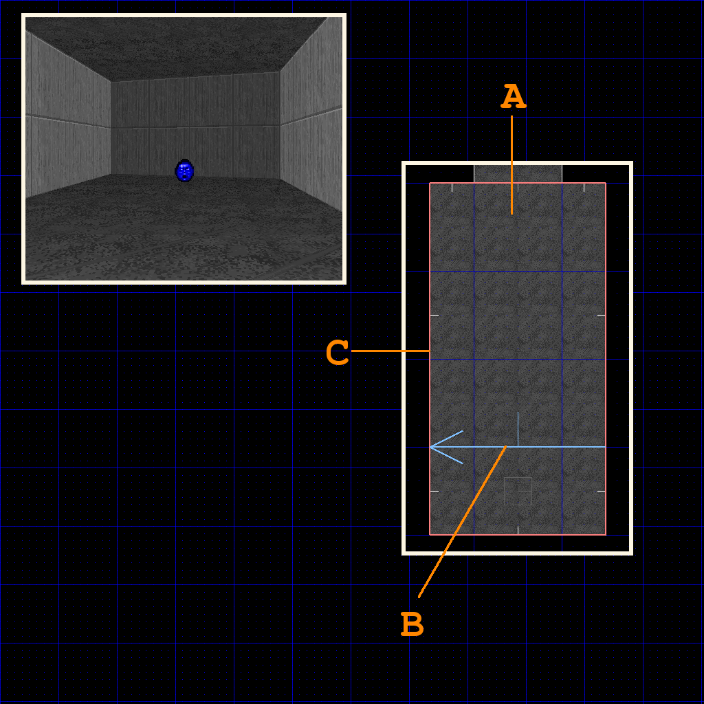
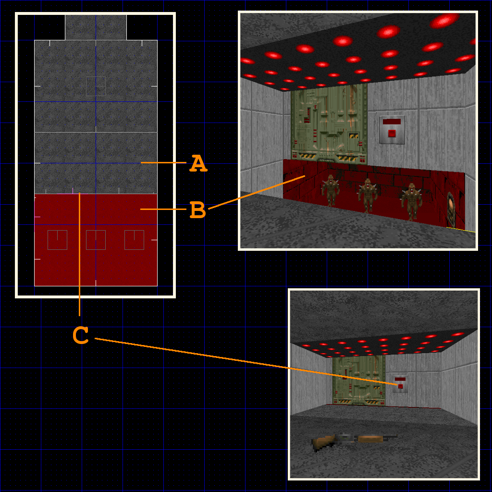
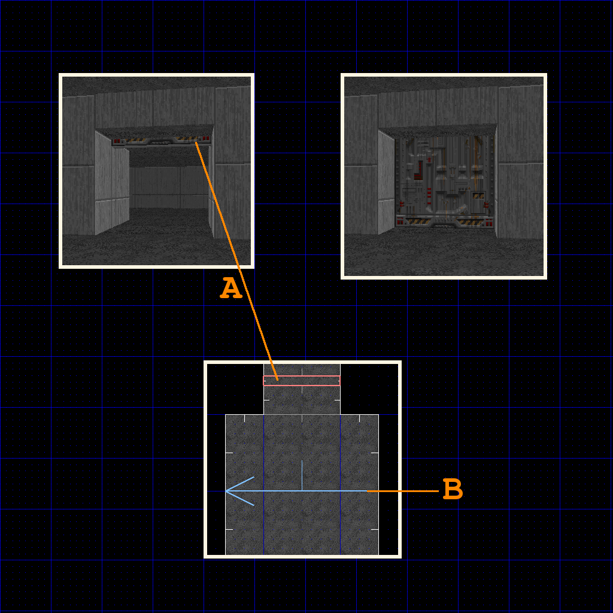
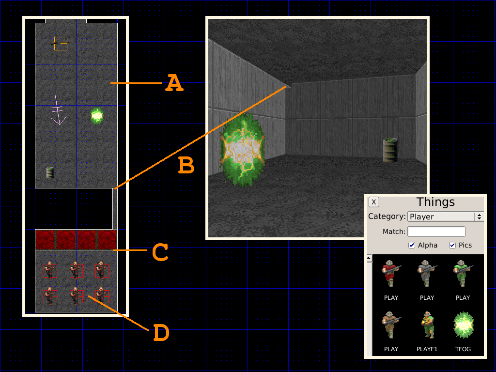
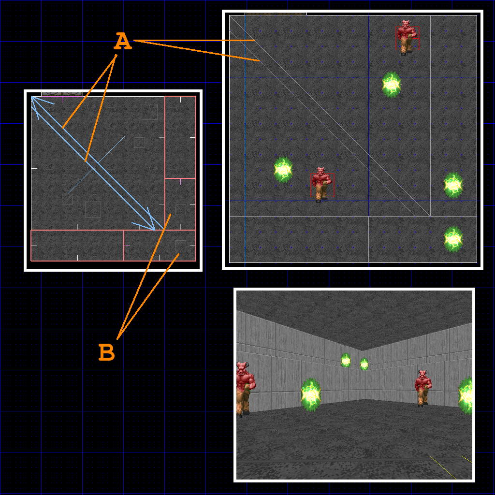
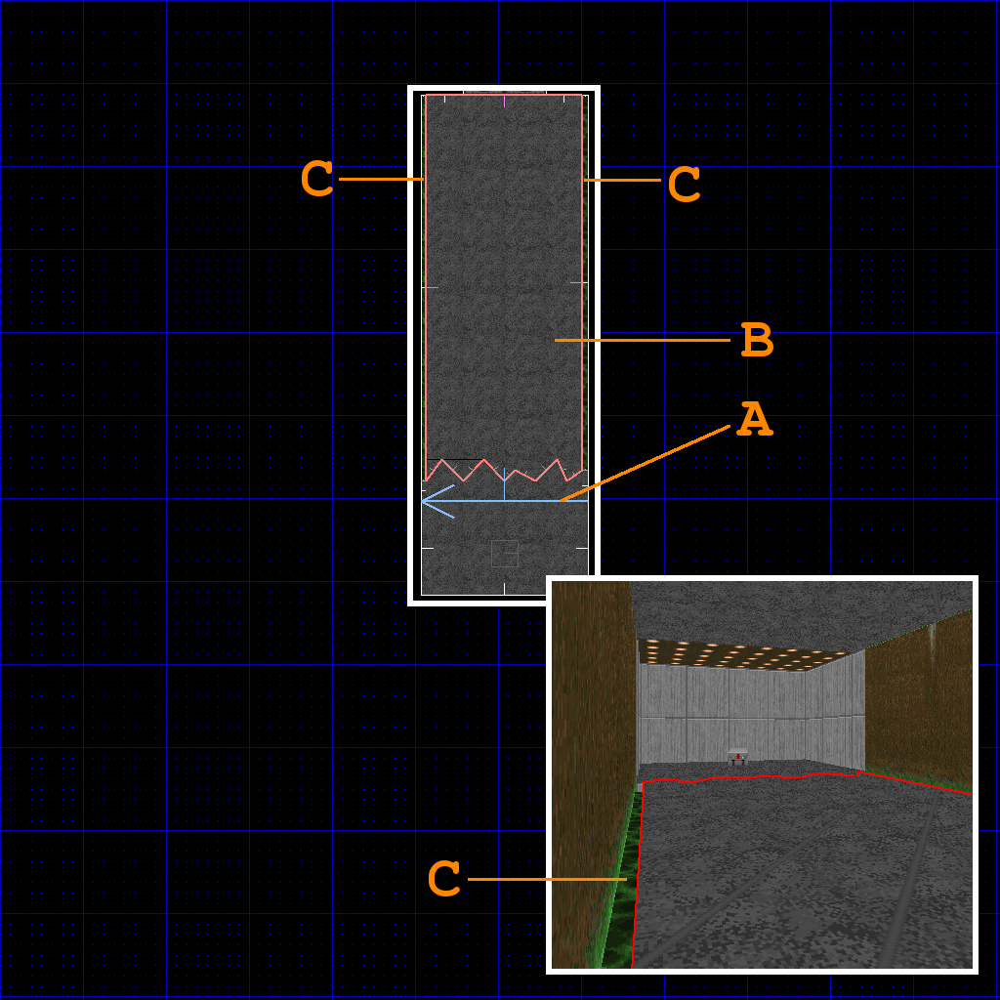

Ловушки
=======

Примеры
-------

Все примеры доступны для тестирования в файле :download:`traps.wad`

Нежданчик 1-й (скрытая комната с монстрами)
-------------------------------------------

Монстры находятся в скрытой комнате, отделённой дверью или панелью, которая открывается внезапно для игрока.

* Рисуем скрытый сектор (А), добавляем туда монстров.
* Создаём дверь скрытого сектора (B).
* Закрываем дверь и придаём ей вид обычной стены (C).
* Задаём новый тэг сектору двери (B).
* Рисуем линию-триггер, которая будет открывать дверь комнаты с монстрами, и задаём ей тэг двери (D).
* Задаём линии-триггеру тип **109 W1 Open and stay fast**  (D).

Нежданчик 2-й (платформа с монстрами)
-------------------------------------

Мностры спускаются на платформах, скрытых потолком. Особенно неприятно, когда ты идёшь за ключом в дальнем углу.

* Рисуем платформы и добавляем на них монстров (A).
* Поднимаем полы и потолки платформ (B), пока их пол не сравняется с потолком основной комнаты.
* выбираем сектора платформ (A) и назначаем им новые тэги.
* Вставляем пару вершин в стену, чтобы получился отрезок в 64 еденицы для кнопки (C).
* Добавляем на отрезок текстуру кнопки или переключателя(C).
* Задаём тэг платформ линии с кнопкой (C).
* Задаём линии с кнопкой (C) тип **23 S1 Floor down LEF**.

Пресс ("давилка")
-----------------

Потолок опускается, раздавливая игрока.

* Задаём сектору-прессу новый тэг (A).
* Рисуем линию-триггер и назначаем ей тэг сектора-пресса (B)..
* Задаём линии-триггеру (B) тип **6 W1 Crusher /fast**

.. На заметку::

    Если не хочется, чтобы стены сектора-пресса двигались вслед за потолком, ставим галочку в **lower unpeg**, выделив линии сектора (C).

.. Внимание::

    Быстрый пресс забирает здоровье понемногу, давая шанс на побег после удара. Медленный пресс даёт шанс на побег в начале, но если прозевал - умрёшь жуткой смертью.

Провал в подпол 
---------------

Пол внезапно проваливается, и игрок попадает в комнату с монстрами.

* Рисуем сектор, который будет проваливаться перед игроком (A).
* Задаём ему тэг (A).
* Добавляем скрытую комнату, куда игрок будет проваливаться, и опускаем её (B).
* Вставляем 2 вершины и создаём переключатель (C).
* Задаём переключателю тэг (C) проваливающегося сектора (A).
* Задаём линии переключателя тип **123 SR Lift Lower /fast** (C).

Ловушка-мышеловка
-----------------

Запирая все пути к отступлению, уровень заставляет игрока расправляться с монтрами по-быстрому.

* Создаём дверь (A) и задаём ей новый тэг.
* Рисуем линию, которая запустит процесс закрытия двери (B), и задаём ей тэг двери.
* Задаём линии-триггеру тип **16 W1 Close for 30s**

.. На заметку::
    Если будет нужно закрыть несколько дверей, задаём им один тэг на всех.

Нежданчик 3-й, из телепорта
---------------

Монстры в секретной комнате, услышав шум стрельбы, начинают беситься и телепортируются на уровень.

* Назначаем новый тэг сектору, из которого монстры будут телепортироваться в сектор (A).
* Ставим предмет **Teleport exit** (тип 14, под категорией "Player", сокращенно `TFOG`) в сектор (A).
* Рисуем скрытую комнату, где будут стоять монстры (D).
* Соединяем основную комнату (A) со скрытой (D) отдушиной (B). Это поможет звуку проникнуть в скрытую комнату и поднять шум среди монстров.
* Рисуем триггер-линию телепорта в скрытой комнате (C), назначаем ей тот же тэг, что и у основной комнаты (A), и задаём тип **97 WR Teleport**.

.. На заметку::

    Используй режим **Sound Sector Rendering** (в меню View), и перейди в **режим работы с секторами**, чтобы в 2D виде посмотреть, как распространяется звук.

Боевая телепортация
-------------------

Монстры телепортируются из одного угла карты в другой, заставляя игрока конкретно понервничать. Эта ловушка хорошо показана в Doom II, map 10, где нужно уворачиваться от Кибердемона.

* Создаём линии-триггеры с типом **Type 126 WR Teleport /mon** (A).
* Задаём новый тэг линии-триггеру (A).
* Присваиваем тот же тэг сектору (B)
* Ставим предмет **Teleport exit** в секторе (B).
* При необходимости повторяем данные шаги для создания большего количества телепортов и усложнения атак.

Токсичный сюрприз
-----------------

Токсичные отходы заливают пол, нанося игроку урон во время движения.

* Рисуем линию-триггер и задаём тип **37 W1 Floor down LEF /NXP** (A).
* Также задаём линии-триггеру новый тэг (A).
* Задаём тот же тэг нашему сектору-ловушке (B).
* Сектор-ловушка(B) должен быть окружен сектором с кислотой (C).
* Сектор с кислотой (C) должен быть ниже опускающегося сектора (B).
* Задаём сектору с кислотой (C) тип **7 Damage 5%** и текстуру **NUKAGE1**. При срабатывании сектор (B) опустится до уровня сектора с уроном (C) и переймёт все его параметры (урон и текстуру).
