Базовые понятия
===============

.. На заметку::

    ЛКМ: клик Левой Кнопкой Мыши, ПКМ: клик Правой Кнопкой Мыши

Вершины
--------

Вершины соединяют линии сектора между собой.

* Жмём :kbd:`v` в 2D виде для перехода в режим работы с вершинами
* :kbd:`ЛКМ` на линии вставляет вершину
* :kbd:`ПКМ` ставит вершину и включает режим **рисования линий**, в котором, продолжив жать :kbd:`ПКМ` и замкнув контур, мы получим сектор

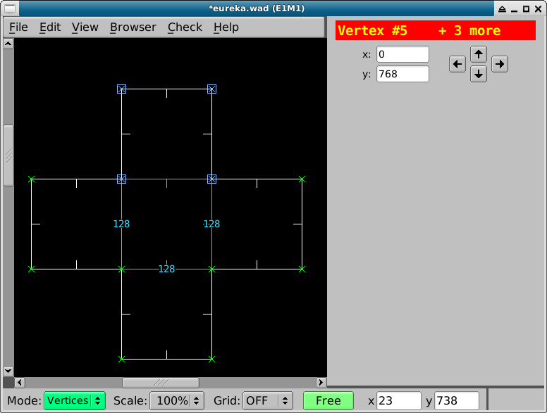

Линии
--------

Линии делят карту на сектора. Также они используются для укзания различных экшонов.

Жмём :kbd:`l` в 2D виде, чтобы попасть в режим работы с линиями.

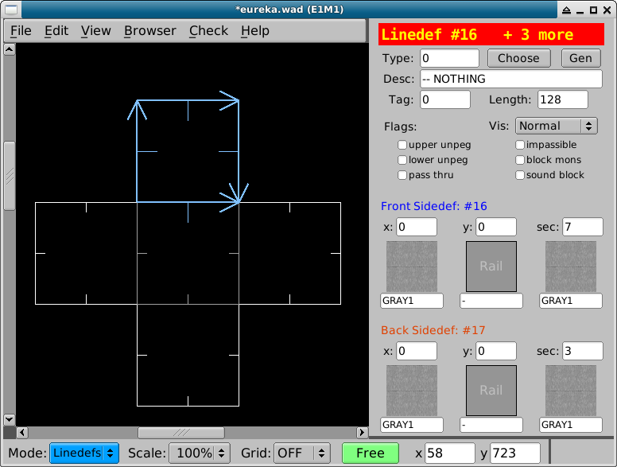

Также линия имеет лицевую и обратную стороны. Определить лицевую сторону линии можно по короткой перепендикулярной линии, выступающей из середины.

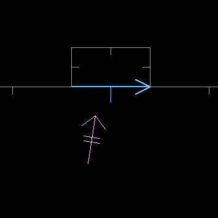

*линия повернута лицевой стороной вниз*

Сектора
-------

Сектор - участок карты, очерченный несколькими линиями.

Жмём :kbd:`s` в 2D виде для перехода в режим работы с секторами.

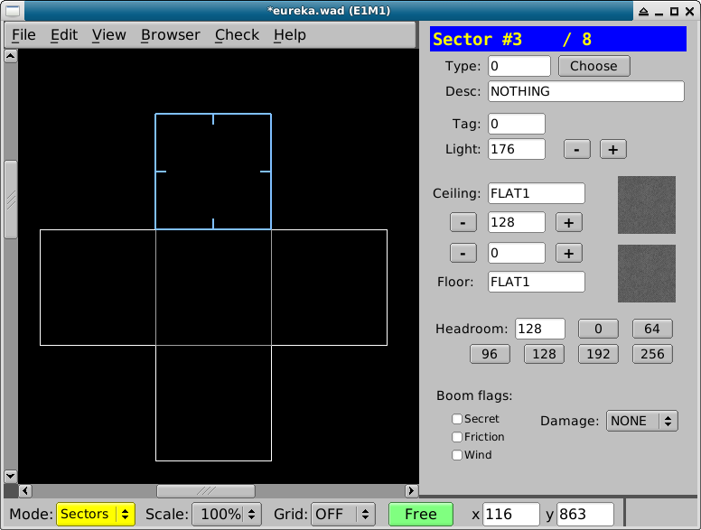

Объекты
-------

Объект нужен для обозначения игрока, монстра, предметов дектораций, бонусов, точек старта в мультиплеере и точек телепорта.

Жмём :kbd:`t` в 2D виде для перехода в режим работы с объектами. :kbd:`space` или :kbd:`ins` вставляют новый объект туда, куда указывает курсор.

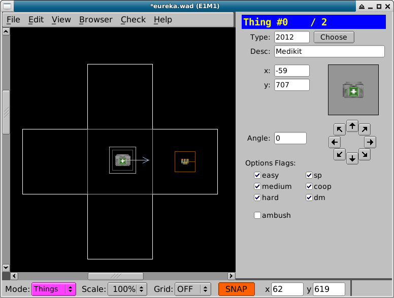

Мульти-выбор 
-------------

При необходимости, перейдя в 2D вид, можно выделять вершины, линии, сектора и объекты при помощи:

* Клика по ним (при повторном клике по объекту выделение снимается)
* Выделения объектов рамкой, котрая появляется при зажатии ЛКМ
* Удерживая :kbd:`shift` и :kbd:`ЛКМ` - выделение рамкой нескольких объектов

Переключение между режимами работы с вершинами, линиями и секторами сохраняют выделение, если это возможно.

Отмена выделения
----------------

Жмём :kbd:`\`` (обратный апостоф) в 2D виде, и выделение со всех объектов снимается.

Трансформация
-------------

У секторов, линий и вершин имеется возможность менять форму и размер.

Изменение размера
^^^^^^^^^^^^^^^^^

Менять размер объекта можно через меню :kbd:`Edit -> Scale Objects`, или через клавишу :kbd:`F3`, которая вызовет диалоговое окно.

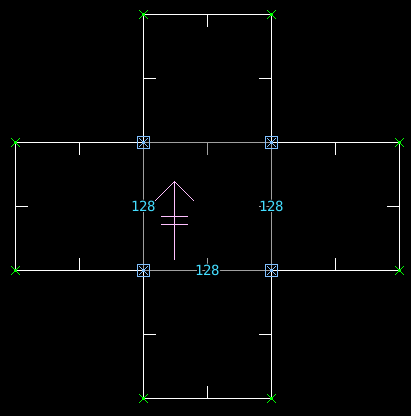

*Выбраны 4 основных вершины*

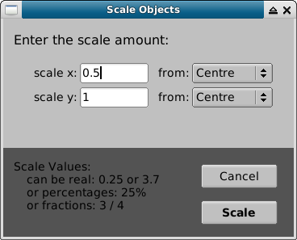

*Смещение вершин на 50% по оси X*

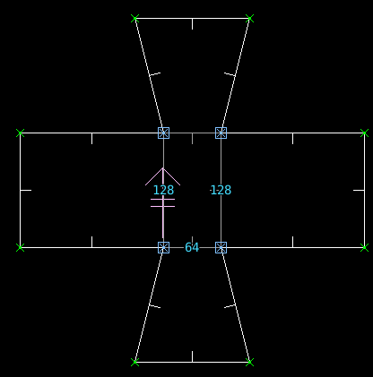

Вращение
^^^^^^^^

ПО пункту меню :kbd:`Edit -> Rotate Object` или  нажатию :kbd:`F4` появится диалоговое окно вращения.

*Выбраны 4 основных вершины*

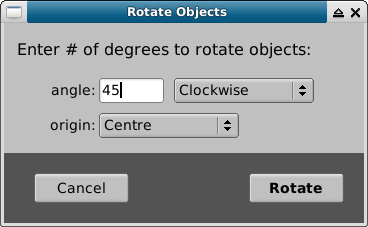

*Вершины повёрнуты на 45 градусов*

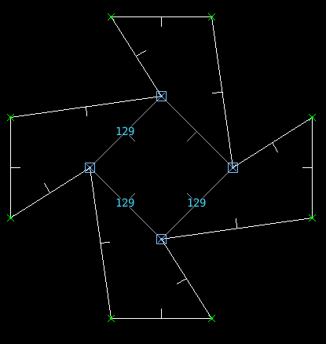

Текстуры
--------

Стороны
^^^^^^^

Стороны содержат в себе данные о расположении текстур линии, которые могут быть **нижними**, **средними** и **верхними**.

Связь разных уровней стороны прекрасно илюстрируется отвратительным выбором текстур:

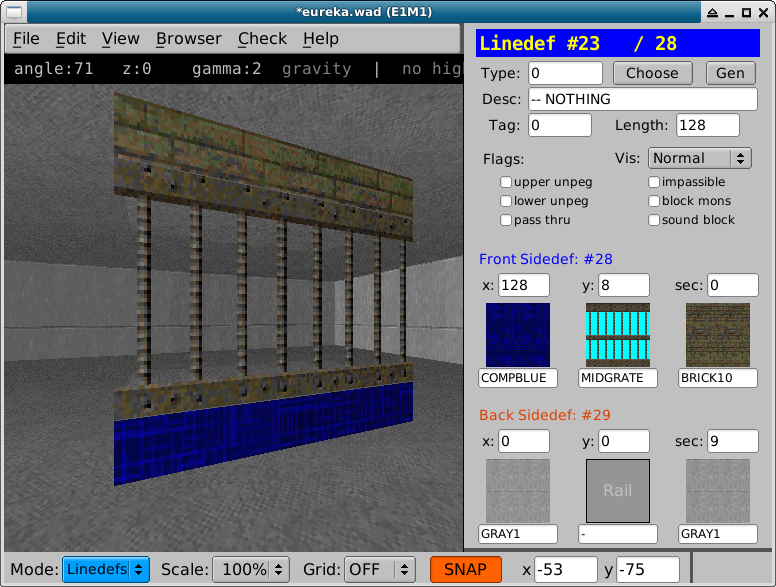

*Нижний уровень - COMPBLUE, средний - MIDGRATE, верхний - BRICK10*

**Смена текстур на стенах**

* Переходим в 2D вид
* Включаем режим работы с линиями (:kbd:`l`)
* Выделяем одну или несколько линий

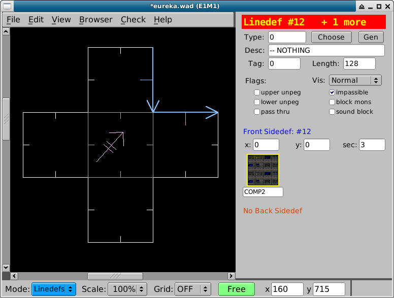

* Кликаем по кнопке текстуры "Front sidedef".Откроется браузер текстур.
* (опционально) Жмём :kbd:`tab` и преезходим в 3D вид для просмотра изменений "вживую"
* Выбираем текстуру в окне браузера

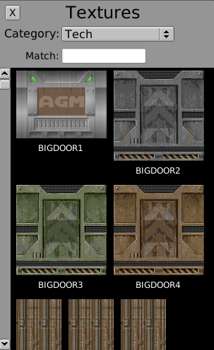

Текстуры пола и потолка
^^^^^^^^^^^^^^^^^^^^^^^

Переходим в режим работы с секторами и выбираем нужный сектор:

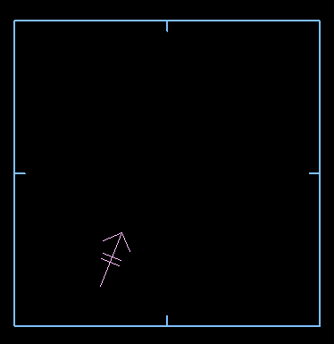

Кликаем по кнопке текстуры. Откроется браузер:

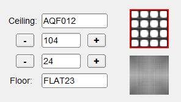

Жмём :kbd:`tab` и пререходим в 3D вид для просмотра изменений "вживую":

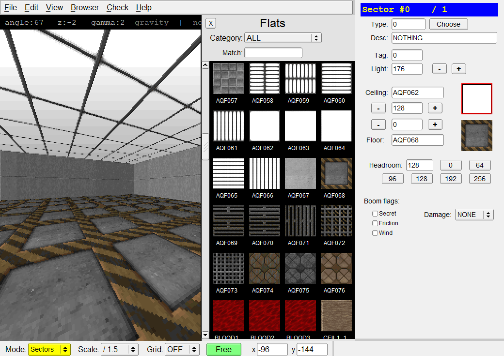

Выбираем текстуру в окне браузера
