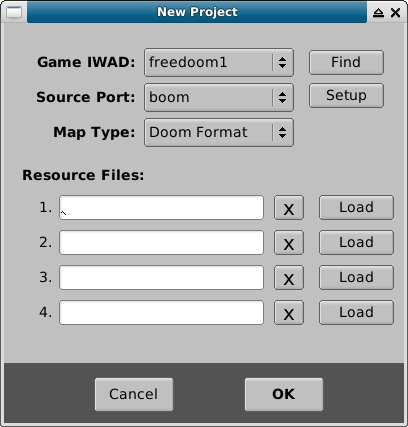
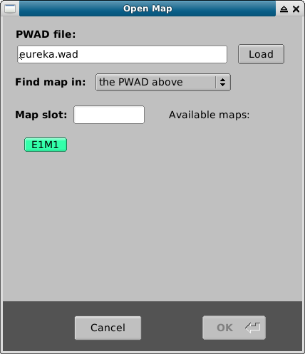
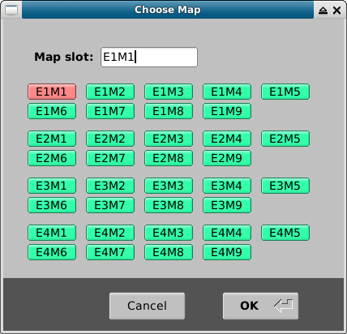
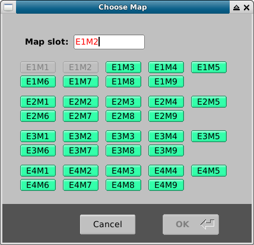
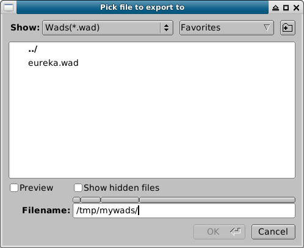
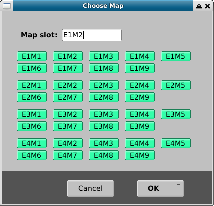

Работа с проектом
=================

Твой WAD может содержать несколько карт, которые нумеруются согласно того порядка, который заложен в выбранном тобой IWAD.

Для Doom1 или Freedoom1 у тебя будет 4 эпизода по 9 карт в каждом: E1M1-9, E2M1-9, E3M1-9 и E4M1-9.

Для Doom2, или Freedoom2, у тебя будет 32 карты: MAP01 - MAP32.

Данные мануал затачивается под Freedoom1 IWAD.

Создание нового WAD
-------------------

Через пункт меню :kbd:'File -> New Project' или сочетание клавиш :kbd:'Ctrl+N' вызываем диалогое окно сохранения WAD, вбиваем имя файла, выбираем место, и кликаем "OK".

Затем, настраиваем новый проект:

* IWAD: выбираем freedoom1 из списка, жмём кнопку **Find** и указываем его местоположение.
* Source Port: выбираем boom (или тот, что нравится) из списка, жмём **Setup** и указываем местоположение екзешника
* В случае с GNU / Linux, расположение исполняемого файла можно узнать с помощью команды ``which prboom-plus``.

Закансиваем настройку и кликаем **OK**.

Открываем карту
---------------

Открываем окно выбора карты через пункт меню :kbd:`File -> Open Map` или сочетание клавиш :kbd:`control-o`. В выпадающем еню выбираем пункт **Find map in the PWAD above**, в противном случае для выбора будут доступны только карты из freedoom1.

Добавляем карту
---------------

Открываем окно добавления карты через пункт меню :kbd:`File -> Fresh Map`. Розовым отмечены занятые слоты, зелёным - свободныеЦ.

Переименовываем карту
---------------------

Через пункт меню :kbd:`File -> Rename Map` можно изменить порядок карт, выбрав в диалоговом окне новый слот.

Занятые слоты выбирать нельзя.

Копируем карту
----------

Пункт меню :kbd:`File -> Copy Map` открывает окно, в котором выбираем слот для скопированной карты.

Удаляем карту
------------

Пункт меню :kbd:`File -> Delete Map` удалит текущую карту из WAD, запросив подтвердение.

Экспортируем карту
------------------

Пункт меню :kbd:`File -> Export Map` поможет экспортировать карту в:

* новый WAD
* уже существующий WAD

*Выбор файла, в который будет экспортирована карта*

*Выбор слота, в который будет экспортирована карта*

