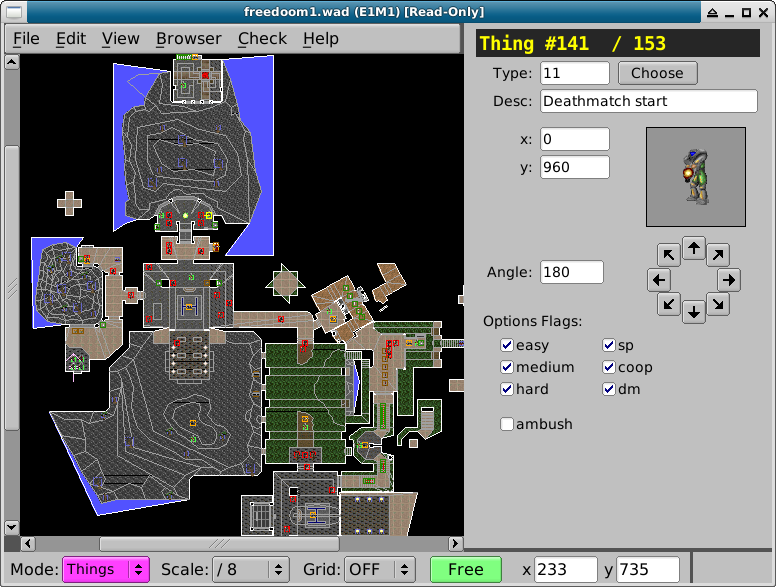
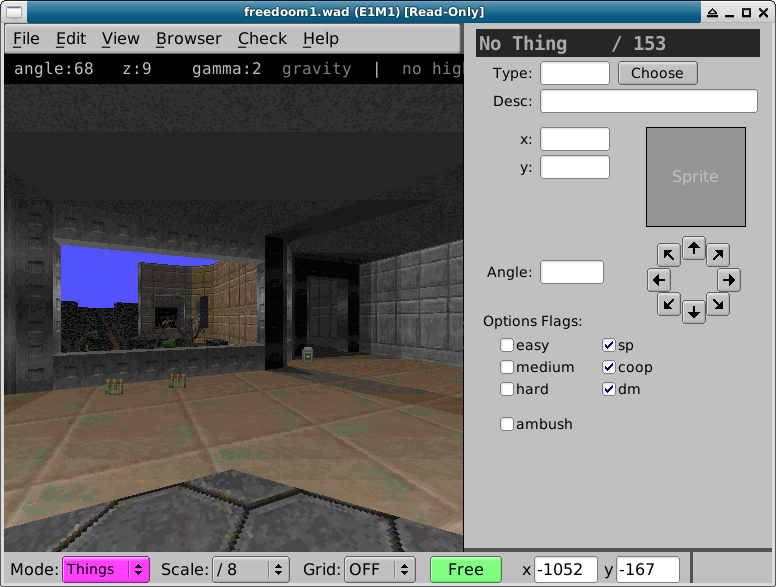
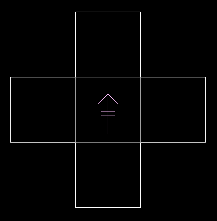
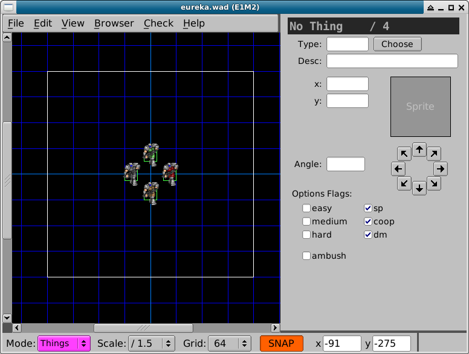
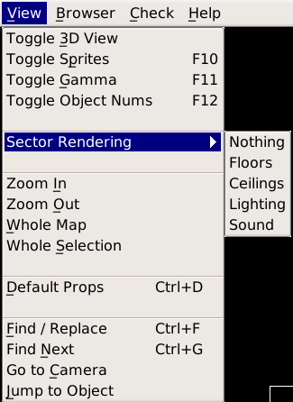
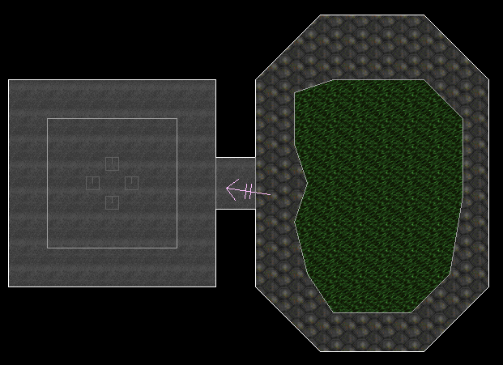
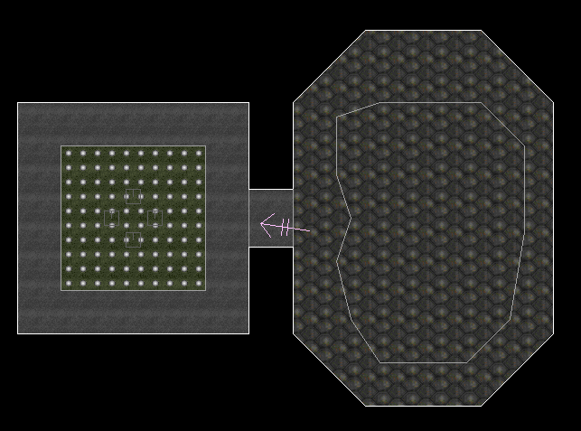
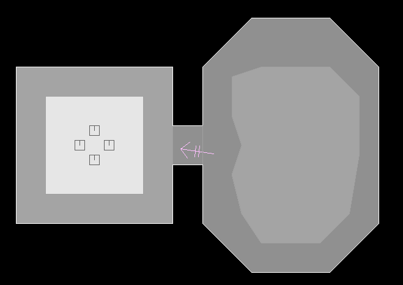
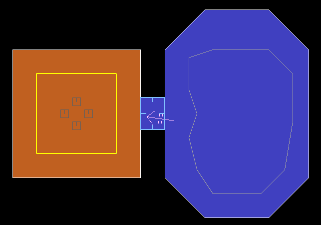
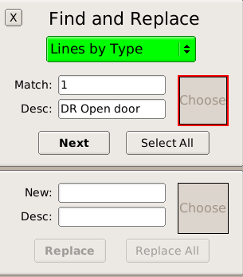

Интерфейс пользователя
======================

Eureka обладает двумя основными режимами работы с картой - 2D и 3D. Переключаться между режимами можно клавишей :kbd:`tab`.

*2D вид используется, собственно, для маппинга - построения уровней и расстановки предметов на них*

*3D вид используется для предпросмотра уровня при калибровке освещения, выборе текстур пола и потолка*

Движение и масштабирование
--------------------------

Для перемещения в 2D виде используются:

* Колёсико мыши - масштабирование
* Средняя кнопка мыши (под колёсиком) - захват и перемещение рабочей поверхности
* Клавиша :kbd:`home` - отмасштабировать рабочую область так, чтобы была видна вся карта целиком

Камера
------

Стрелочка в 2D виде показывает текущее положение 3D камеры.

* Клавиша :kbd:`'` (одиночная кавычка) в 2D виде переносит 3D камеру в точку, на которой находится курсор.
* Клавиша :kbd:`end` в 2D виде определяет центром карты координаты 3D камеры.

В 3D управлять перемещением камеры можно следующими способами:

* Колёсико мыши - вперёд / назад
* Удерживать СКМ и двигать вправо / влево - поворот камеры
* Удерживать СКМ и двигать вперёд / назад - поднимать / опускать камеру

Сетка координат
---------------

Включать сетку координат можно в выпадающем меню **Grid** на нижней панели, или клавишей :kbd:`g`. Быстро переключаться между размерами ячеек можно клавишами :kbd:`0-9` в врехнем ряду клавиатуры.

Переключаться между режимами с привязкой к сетке и без можно клавишей :kbd:`f`.

.. На заметку::

    Если во время перетаскивания крупной карты редактор начнёт лагать, отключи на время перетаскивание сетку клавишей :kbd:`g`.

Режимы отрисовки
----------------

В меню `View / Sector Rendering` можно выбрать режим отрисовки секторов.

Полы
^^^^

Сектора будут отрисовываться с текстурой пола.

Потолки
^^^^^^^

Сектора будут отрисовываться с текстурой потолка.

Освещённость
^^^^^^^^^^^^

Данный режим показывает уровень освещённость секторов.

Звук
^^^^

Этот режим показывает, как распространяется звук. Наводим курсор на нужный сектор, чтобы увидеть, как будет распространяться звук.

Поиск и замена
--------------

Панель поиска и замены открывается через пункт меню `View / Find` или сочетанием клавиш :kbd:`control-f`.

Можно искать предметы, текстуры линий, плоскости полов, линии по типу (спэшлу) или секторы по типу.

